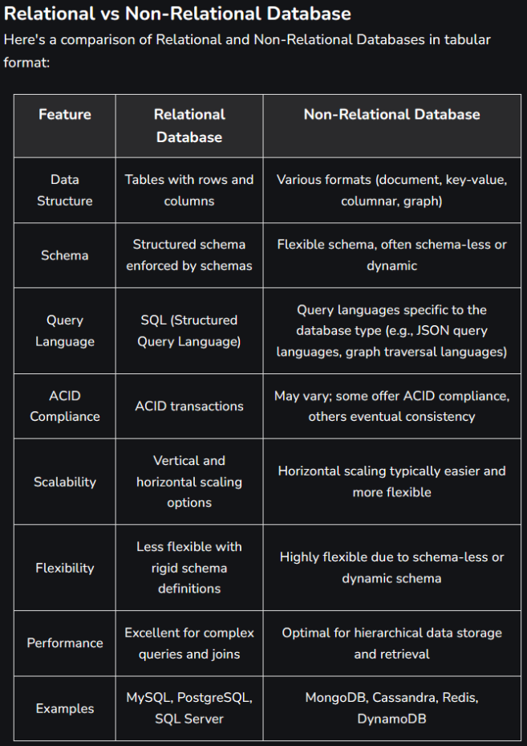

# Task: Database Research

## Research relational and non-relational databases, and address the following points

- What is the structure of the database
- When would this database be used
- Explain a comparison of the two, as well as examples of these databases

### Relational Databases
    - Comprises multiple tables that interconnect
    - Data should be normalised (3 Normalised forms) so that databases shouldn't overlap in content and should be connected via a primary key.
        - A primary key should uniquely identify each entity in a table
    - Uses SQL (Structured Query Language) - used to filter and update tables.
    - Uses standard data-types
    - Better for complex queries
  
    - Used for: Employee databases, Financial Databases, E-Commerce
  
    - Types: MySQL, SQL Server, Postgres, Oracle

### Non-Relational Databases
    - No-SQL databases
    - Used for unstructured or semi-structured data.
    - Uses non-standard data types such as images that cannot be compared.
    - Great for social media, as posts may consist of varying elements.
    - Optimised for real-time data ingestion and high-speed transactions.
    - Don't enforce a rigid schema, so allow the data structure to evolve without downtime.
    - Better Scalability and flexibility.
    - Better performance for simple queries

    - Used for: IoT, Social Media, Big Data sets

    - Types: MongoDB, Couchbase, DynamoDB, Redis, Cassandra, HBase

    Document Databases: Store data as JSON, XML or BSON. MongoDB, Couchbase
    Key-Value: Store Key-Value Pairs,  DynamoDB, Redis
    Column-Oriented: Use tables with dynamic columns, a column-based version of relational databases, which allows for improved query performance.   Apache Cassandra, Apache HBase. 
    Graph Databases: Use nodes and edges to map complex relationships.  Neo4j, OrientDB

### Relational always conform to ACID; some non-relational offer ACID compliance:
    - Atomicity: Transactions either complete or don't. Transactions are a single unit.
    - Consistency: Updates are handled in predefined and predictable ways to prevent errors.
    - Isolation: Updates run sequentially, ensuring that one operation is fully completed before the next is run.
    - Durability: Changes are permanent and persistent across system failures such as power outages.

### Key pillar of relational, but can be used Non-Relational conform to BASE:
    - Basically Available: Ensuring data is available by distributing it across different nodes of a distributed database
    - Soft State: The developers are responsible for consistency across data, not the database
    -Eventually Consistent: Should be ultimately achieved, but cannot be guaranteed for individual transactions.

