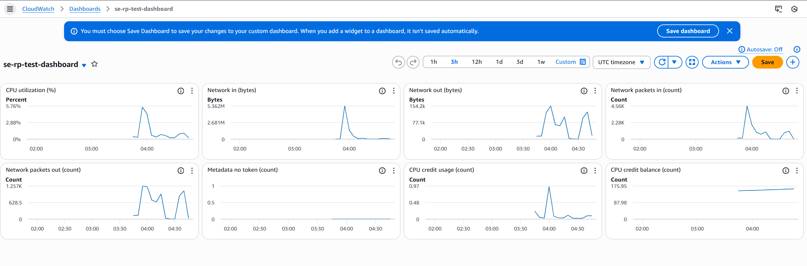
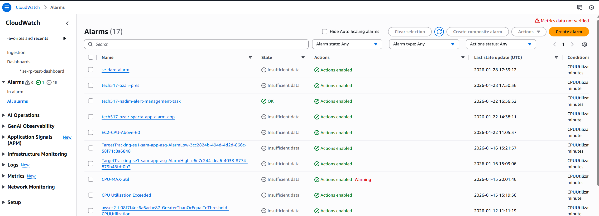
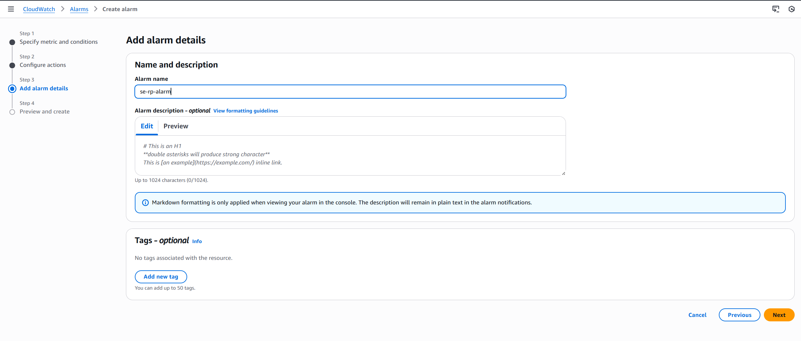
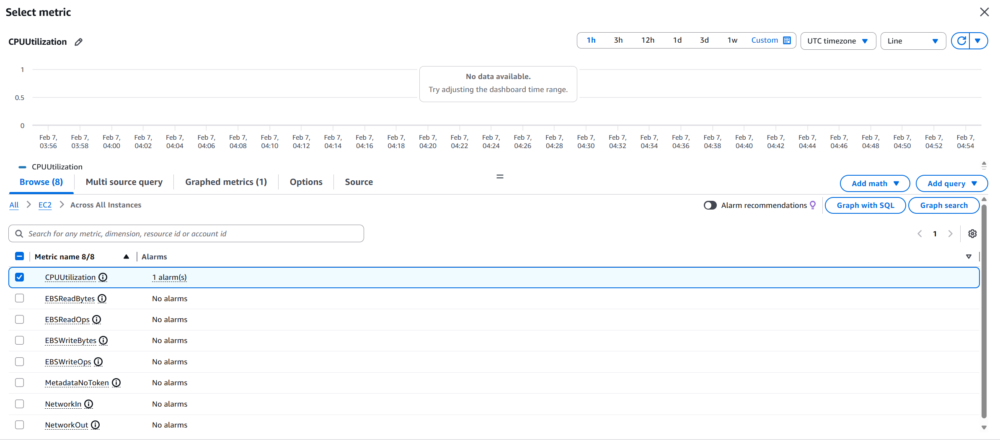
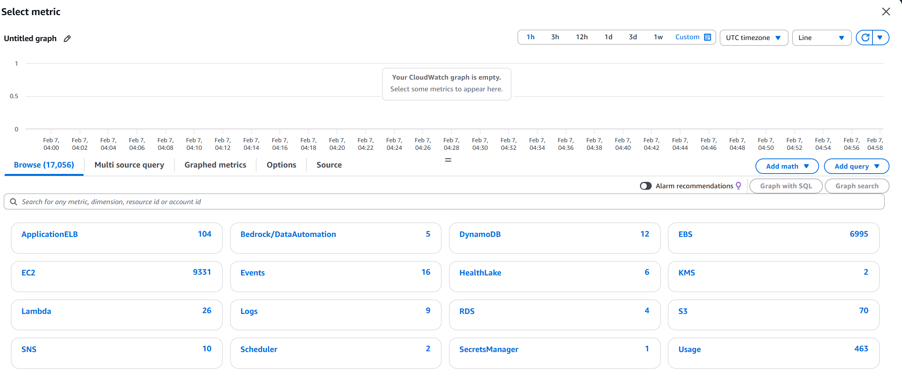
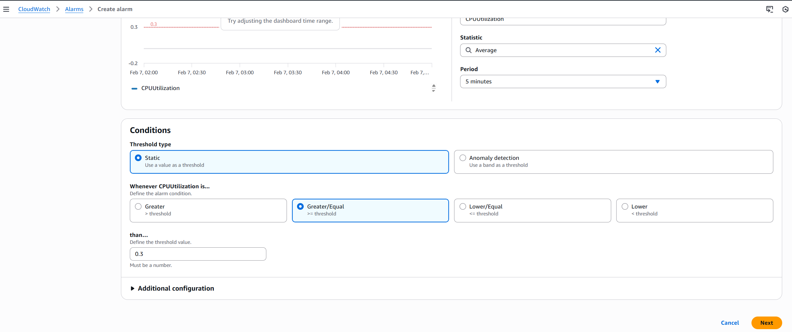
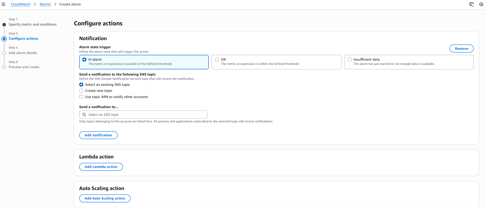
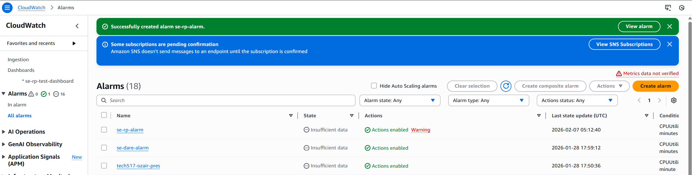

# Monitoring

## Turn on Monitoring

- Add Dashboard
- Create New Button
- Click add to Dashboard
- After about 60s, monitoring graph will update.
  
 

### Set up an alarm

- Go to the cloudwatch section of the AWS website and click 'all alarms' at the side.
- Click the orange 'Create Alarm' button in the top-right.
- 
 

- Add alarm details  
    

 - Go to EC2 page and click select metric

- For this, I will go EC2 -> Across All Instances -> CPUUtilisation.

- Set up conditions

- Once everything is done correctly. You'll get that message like below:

- Notifications:
  

