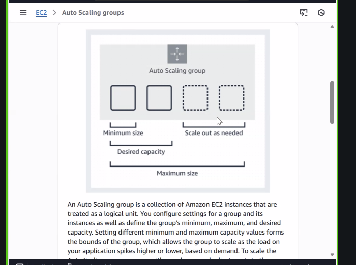
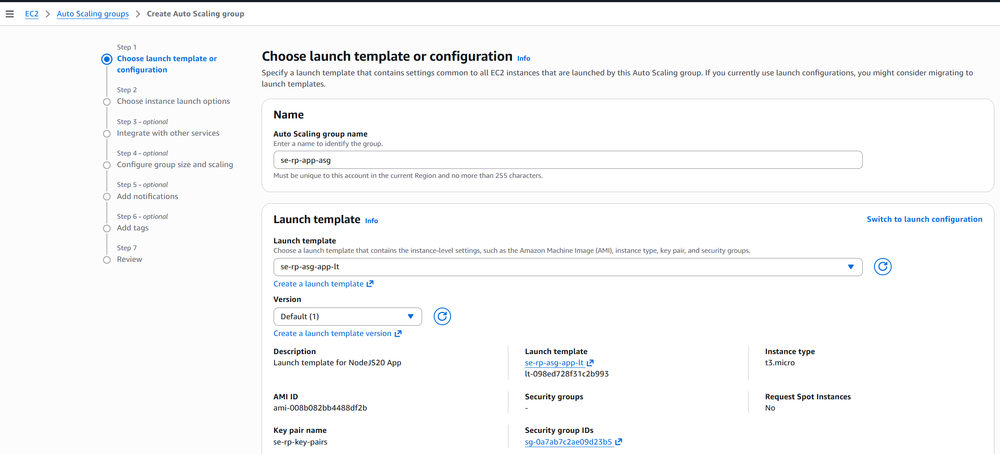
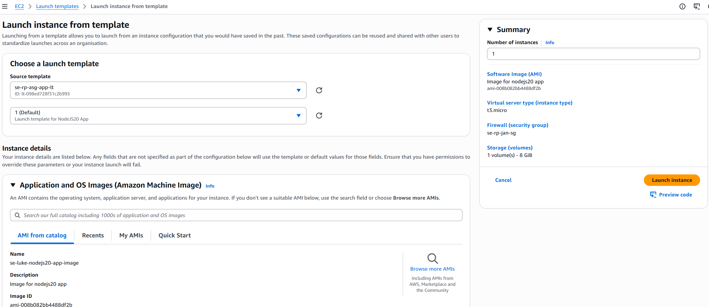
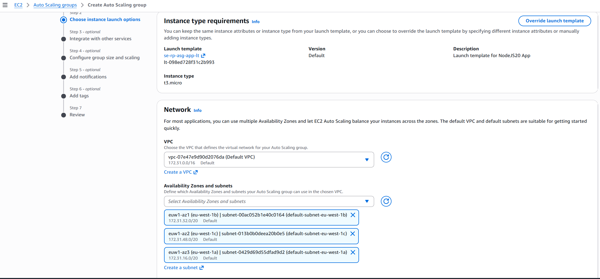
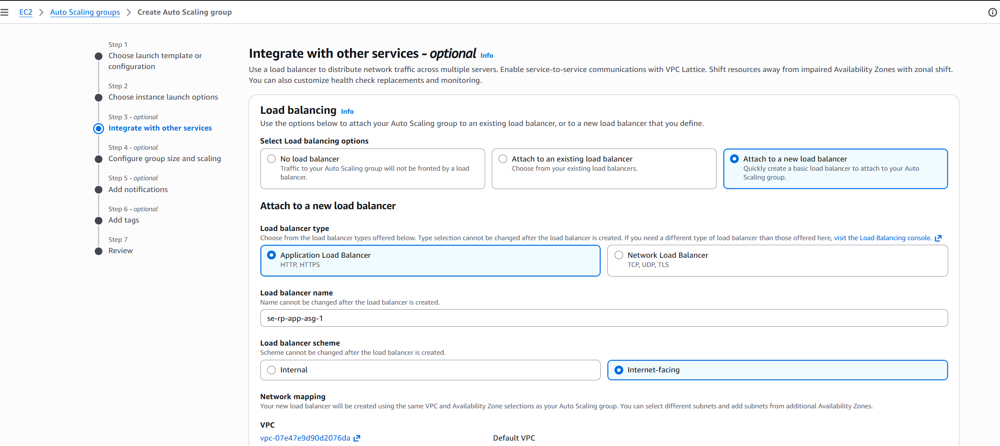
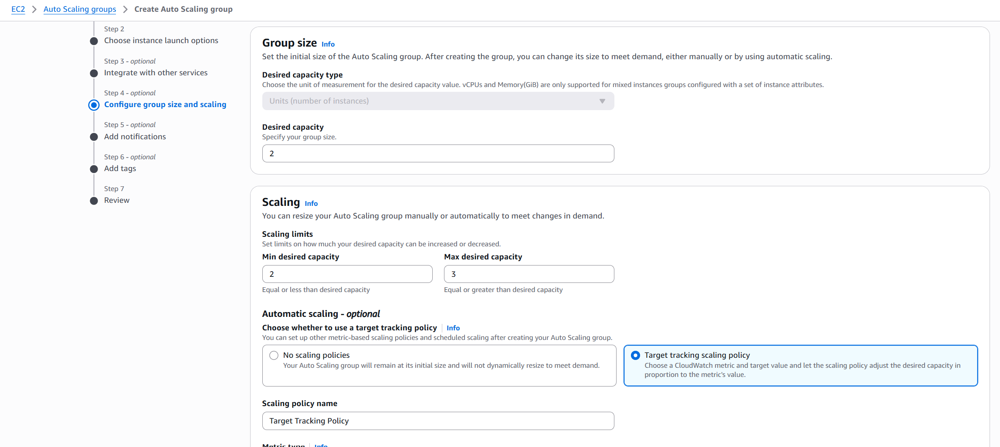
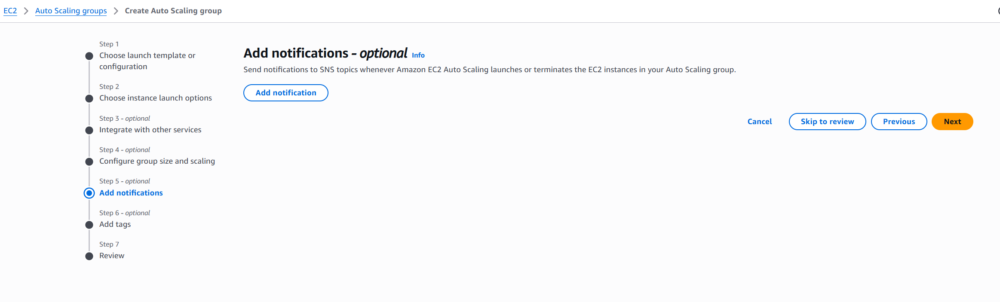
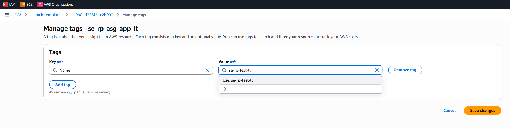
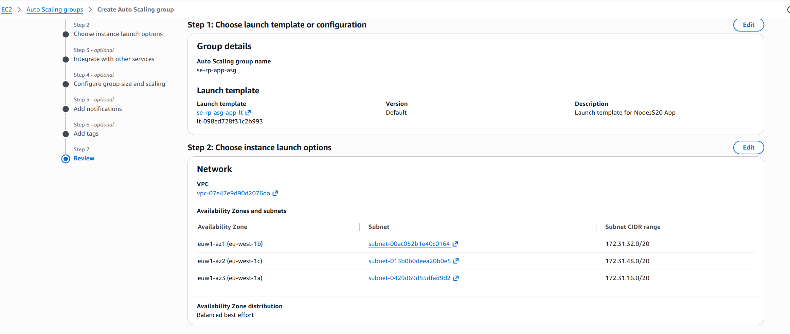
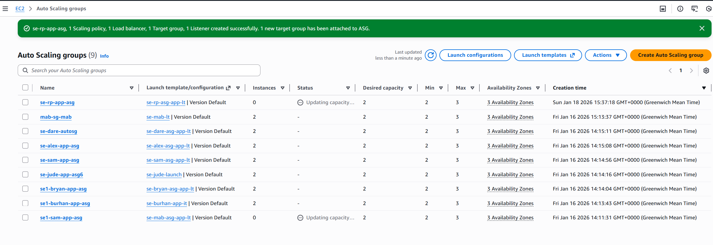

# Automating Machines, Load-Balancing and Auto-Scaling

## When launching an instance

- Load the node20-app image machine instance, but add the following:

- In advanced settings, fill in the following

```
#!/bin/bash

sleep 15

cd /home/ubuntu

cd se-sparta-test-app
cd app

export DB_HOST=mongodb://IPADDRESS:27017/posts

sudo npm install

node seeds/seed.js

pm2 start app.js
```
 - Launch the MongoDB instance to grab the IP address and add it to the environment variable.
 - We can do this as we already have the apps installed on the instance.
 - Load Balancer moves things from an overloaded VM to a non-overloaded VM.

 ### ASG: Auto-Scaling Group

- When two CPUs hit 50%, a new VM would be spun up using an AMI that the ASG would use for an additional VM.
- We then launch the image and distribute the workload

---

### Different configuration 

 - How this differs from the other 2 methods is that we have:

 - A working database machine, with all necessary set-up, that has been stopped (suspended)
    - This means we simply need to run the instance to have the server run again

 - A working app machine with the app already installed.
    - This means to get it working, we just need to run commands to update the environment variable "DB_HOST" with the database VM's new reseed, and start the app with pm2 (already installed).

 - When booting up the VM, we can give commands to be run on startup to AWS using advanced settings, and this will be run automatically.
 - This means we don't need to use Git Bash/SSH at all, and it is done completely remotely.

 - The purpose of these commands is:
    - sleep 15: Gives the VM time to boot up properly and ensure all dependencies are running before executing any further commands

- AWS will run the commands at the root level by default. Therefore, we cd /home/ubuntu so we are running as the user.
  
### Next steps:

        1. Restart the suspended DB VM and grab its IP.
        2. Run an app VM and put the above script in the advanced settings.
        3. Wait for it to execute and go to http://<ip>:3000/posts.

---

## Auto-Scaling








- Under Advanced Settings, reuse the same script as before.
- Click Create Template.






- Launching from template auto-fills key-pairs, AMIs, advanced settings, security groups, etc.



- To add a name to the instance: 





- HASC: High-Availability Scaling
  


- To check it's running correctly:




- Copy the 'DNS name' and paste it into a browser to get back to the main page:  




